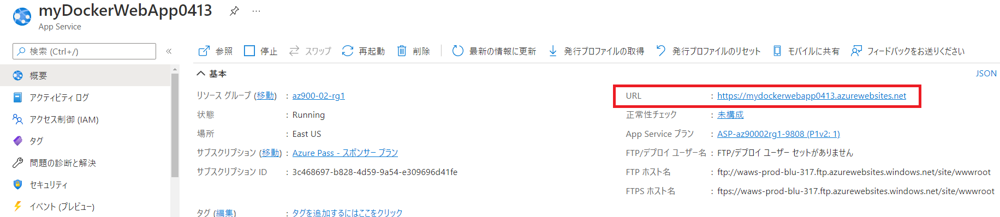

---
wts:
    title: '02 - Web アプリの作成 (10 分)'
    module: 'モジュール 02 - Azure のコア サービス (ワークロード)'
---
# 02 - Web アプリの作成 (10 分)

このチュートリアルでは、Docker コンテナーを実行する Web アプリを作成します。Dockerコンテナではウェルカム メッセージが表示されます。 

Azure App Service は、 4 つのサービスのコレクションであり、Web アプリケーションのホストと実行を支援するために構築されています。4 つのサービス (Web アプリ、モバイル アプリ、API アプリ、ロジック アプリ) は外観が異なりますが、非常によく似た方法で動作します。Web アプリは 4 つのサービスの中で最も一般的に使用されており、このサービスはこのラボで使用するサービスです。

# タスク 1: Web アプリを作成する 

このタスクでは、Azure App Service Web App を作成します。 

1. Azure portal　([https://portal.azure.com](https://portal.azure.com))にサインインします。 

2. Azure portalで「**App Services**」を検索して選択し、**「+ 作成」**をクリックします。

3. 「**Web アプリの作成**」 ブレードの「**基本**」タブで次の通り設定します (Web アプリの名前の **xxxx** は、名前がグローバルに一意になるように文字や数字に置き換えます)。App Service プランを含む、その他すべての既定値をそのまま使用します。 

    | 設定 | 値 |
    | -- | -- |
    | サブスクリプション | **Azure Pass - スポンサープラン** |
    | リソース グループ（新規作成） | **az900-02-rg1** |
    | 名前 | **myDockerWebAppxxxx** |
    | 公開 | **Docker コンテナー** |
    | オペレーティング システム | **Linux** |
    | 地域 | **East US** |
    
    **注:** Web アプリの名前が一意になるように **xxxx** を変更してください。

4. **「次へ」 > 「Docker」** をクリックし、コンテナー情報を構成します。  

    | 設定 | 値 |
    | -- | -- |
    | オプション | **単一コンテナ** |
    | イメージ ソース | **Docker Hub** |
    | アクセスの種類 | **パブリック** |
    | 画像とタグ | **mcr.microsoft.com/azuredocs/aci-helloworld** |
    

 **注:** スタートアップ コマンドはオプションで、この演習では必要ありません。

5. 「**確認および作成**」 をクリックし、「**作成**」 をクリックします。 

# タスク 2: Web アプリをテストする

このタスクでは、Web アプリをテストします。

1. Web アプリがデプロイされるのを待ちます。

2. 上部の青いツール バーからベル アイコンをクリックし、展開が成功したら 「リソースに移動」 を選択します。 

    **注**: 「デプロイ」 ページにて「**デプロイが完了しました**」表示後は、 「**リソースに移動**」 リンクを使用することもできます。 

3. 「**概要**」ブレードで **URL** を探します。URL をクリップボードにコピーします。

    

4. 新しいブラウザー ウィンドウでき、URl を貼り付けて、Enter キーを押します。Azure Container Instance へようこそ! ウェルカム メッセージが表示されます。

    

5. Web アプリの「**概要**」ブレードに戻り、下にスクロールします。データの送受信と要求数を示すグラフが表示されています。手順 4 を数回繰り返すと、対応して統計情報がグラフに表示されます。 

これで、Azure App Service の作成が完了しました。

**注**: 追加コストを回避するために、作成したリソース グループを削除できます。リソース グループを検索して選択し、作成したリソース グループをクリックして、「**リソース グループの削除**」をクリックします。リソース グループの名前を入力し、「**削除**」をクリックします。**通知**を監視して、削除の進行状況を確認します。
